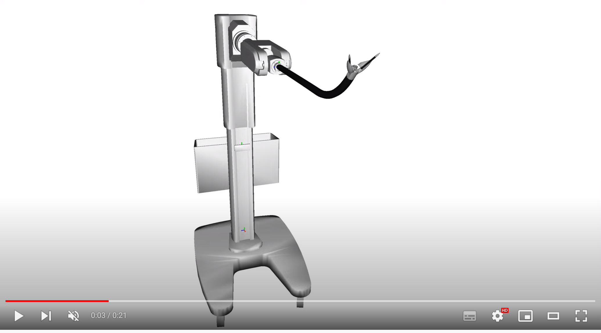
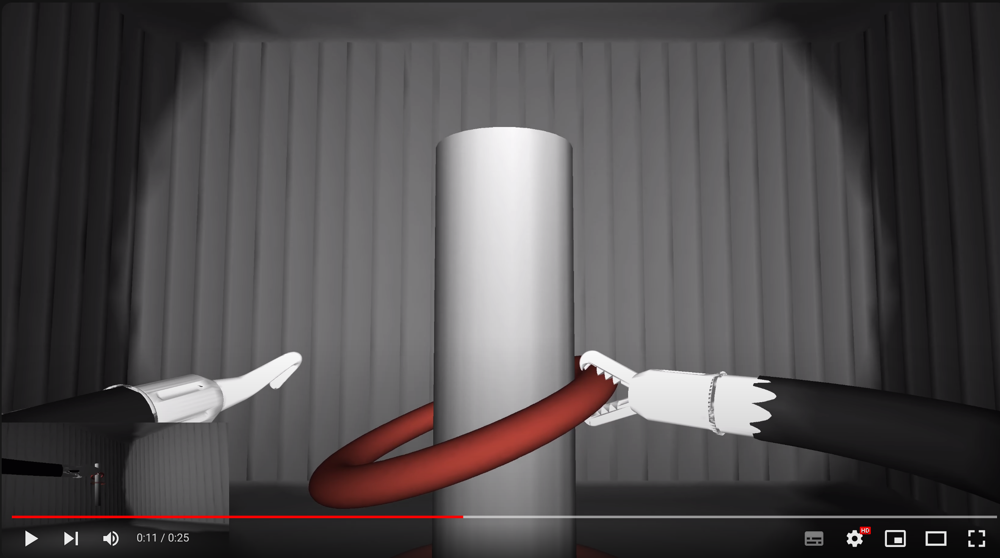
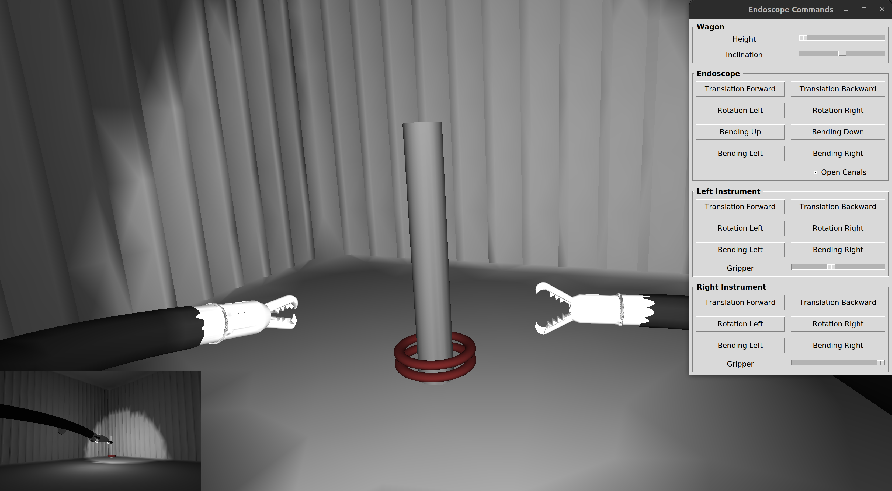

# Endoscopy

Flexible endoscopy platform. 

[](https://www.youtube.com/watch?v=pzuGIGmBcuA)
[](https://www.youtube.com/watch?v=qMfj1V5aJVI)

## Installation


### Required 

The simulations are done using the simulation framework [SOFA](https://www.sofa-framework.org/). Binaries of SOFA with the required and optional plugins are available [here](https://github.com/SofaDefrost/TIRREX/releases). 
If you compile SOFA, download the following source code:

- [SOFA](https://github.com/sofa-framework/sofa) on branch master
- [SofaPython3](https://github.com/sofa-framework/SofaPython3) plugin for SOFA on branch master
- [Cosserat](https://github.com/SofaDefrost/Cosserat) plugin on branch master
- [BeamAdapter](https://github.com/sofa-framework/BeamAdapter) plugin on branch master 
- [SoftRobots](https://github.com/SofaDefrost/SoftRobots) plugin on branch master 
- [STLIB](https://github.com/SofaDefrost/STLIB) plugin on branch master 

and follow these [instructions](https://www.sofa-framework.org/download/). In the CMake GUI also enable the following plugins:

- ArticulatedSystemPlugin (distributed with SOFA)

You will also need to install:

- [toml](https://pypi.org/project/toml/) for the configuration files

### Optional 

- [SoftRobots.Inverse](https://github.com/SofaDefrost/SoftRobots.Inverse) plugin for SOFA to solve the inverse kinematics of the robot
- MultiThreading plugin for SOFA
- [tkinter](https://docs.python.org/fr/3/library/tkinter.html) to use a GUI to control the robot. This package is distributed by default with python on MacOS and Windows.
- [ROS2](https://docs.ros.org/en/humble/Installation.html) to send commands to the robot from an external program (last tested with ROS2 Humble)
- [pyopengl](https://pypi.org/project/PyOpenGL/) to send the SOFA view image through ROS

## How to

First add the repository to your PYTHONPATH. Scenarios are described using toml files. To run a scenario:

```bash
~$ cd TIRREX.Endoscopy
~/TIRREX.Endoscopy$ runSofa scene.py --argv configs/scenario1.toml
```



To make your own scenario. One `EndoscopeWagon` will be added by default. You can have a look at `Endoscopy/config.py` 
to see the default parameters. To change some parameters, just add an `EndoscopeWagon` to `YOUR_CONFIG.toml` with 
your custom parameters. For instance:

```toml
[EndoscopeWagons]
position=[[-600,-1000,0]]
instrumentsHead=["gripper","hook"]  # options are "gripper" or "hook"
hysteresis=[1, 1, 1, 1]  # in mm, cables' play
# hysteresis: [up/down flexion endoscope,
#              left/right flexion endoscope,
#              flexion left instrument,
#              flexion right instrument]
```

To add other items to the simulation:

```toml
[Items]
    [Items.Box]  # "Box" will be the name of the item in your simulation's graph
    filename='scripts/environment/mesh/box.stl'
    collisionFilename='scripts/environment/mesh/boxCollision.stl'
    type='Rigid'  # options are "Rigid" or "Deformable"
```

These parameters have no default value and have to be set by the user. Have a look at `Endoscopy/config.py` to see 
the other optional parameters and their default value.


### Optional 

1. To disable the GUI to control the robot, in `YOUR_CONFIG.toml` set:

```toml
[Simulation]
GUI=false
```

2. If you want to use ROS you will first need to source it in your terminal, for instance:

```bash
~/TIRREX.Endoscopy$ source /opt/ros/humble/setup.bash
```

Then runSofa. To enable the use of ROS, in `YOUR_CONFIG.toml` set:

```toml
[Simulation]
ROS=true
```

3. [DEV] If you want to test the simulation of each part of the platform independently. 
Open a terminal and run:

```bash
~$ cd TIRREX.Endoscopy
~/TIRREX.Endoscopy$ runSofa scripts/instrument/robot.py  # an instrument 
~/TIRREX.Endoscopy$ runSofa scripts/endoscope/robot.py  # the endoscope with two instruments
~/TIRREX.Endoscopy$ runSofa scripts/endoscopewagon/robot.py  # the platform
```


## Features


### Parameters

The geometric and mechanical parameters of the endoscope and instruments can be changed from:
- `TIRREX.Endoscopy/scripts/endoscope/params.py`
- `TIRREX.Endoscopy/scripts/instrument/params.py`

### ROS

Two topics are created on the node *SOFASimulation*:
- the topic **/TIRREX/endoscopy/simulationCommands**, on which the actual dofs values are being published at each time step of the simulation
- the topic **/TIRREX/endoscopy/simulationFramesOI**, on which some frames of interest are being published at each time step of the simulation (see endoscope.py/addFramesOfInterest() and docs/FramesOfInterest.pdf)
- the topic **/TIRREX/endoscopy/simulationImage**, on which the SOFA view image is being published at each time step of the simulation
- and the topic **/TIRREX/endoscopy/interfaceCommands**, on which the simulation is subscribing and looking for commands

The simulation expects the following commands (see file `TIRREX.Endoscopy/controller.py`):

```python
# A list of 12 elements
[ q0, # endoscope flexion Up/Down in degree/s
  q1, # endoscope flexion Left/Right in degree/s
  q2, # endoscope rotation in degree/s
  q3, # endoscope translation in mm/s
  
  q4, # instrument Left translation in mm/s
  q5, # instrument L rotation in degree/s
  q6, # instrument L flexion L/R in degree/s
  q7, # instrument L gripper in degree
  
  q8, # instrument Right translation in mm/s
  q9, # instrument R rotation in degree/s
  q10, # instrument R flexion L/R in degree/s
  q11, # instrument R gripper in degree
]
```

Offsets, limits, and directions for each command/actuation can be changed in the file `TIRREX.Endoscopy/params.py`:

```python
@dataclass
class CommandParams:
    direction: int = 1  # to inverse the direction
    offset: int = 0
    limit: list = field(default_factory=lambda: [0, 0])  # [min, max]
    factor: float = 1


@dataclass
class EndoscopeCommandParams:
    translation: CommandParams = CommandParams(-1, -95, [-205, 1])  # mm
    rotation: CommandParams = CommandParams(-1, -61, [-200, 200])  # degree
    flexionUD: CommandParams = CommandParams(-1, 0, [-150, 150])  # degree
    flexionLR: CommandParams = CommandParams(1, 0, [-150, 150])  # degree


@dataclass
class InstrumentCommandParams:
    translation: CommandParams = CommandParams(-1, -63, [-147, -2])  # mm
    rotation: CommandParams = CommandParams(1, -75, [-360, 360])  # degree
    flexionLR: CommandParams = CommandParams(1, 0, [-36, 36])  # degree
    gripper: CommandParams = CommandParams(1, 13.5, [-5, 30], 1)  # degree
```

## Authors

Eulalie Coevoet
